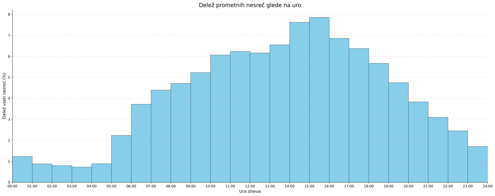
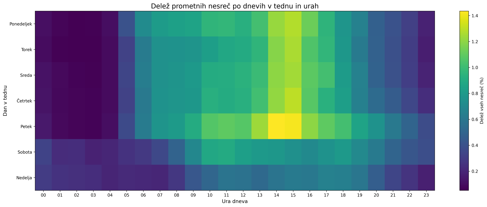

# Analiza podatkov o prometnih nesrečah v Sloveniji (2014 - 2024)

### 1. Opis problema

Cilj projektne naloge je analiziranje prometne varnosti na slovenskih cestah s pomočjo podatkov zadnjega desetletja (2014 - 2024). Z analizo raziskujemo pogoste vzroke za nastanek prometnih nesreč in možne korelacije, ki pripomorejo k verjetnosti za nastanek. Do sedaj smo raziskali časovne vplive, kot so dan v tednu, ura v dnevu, dan v letu, korelacije glede na vremenske okoliščine in trend vožnje pod vplivom alkohola.

### 2. Podatki in čiščenje

Podatke smo prenesli iz odprte baze evidenc, ki jih zbira policija na spletni strani ([policija.si](https://www.policija.si/o-slovenski-policiji/statistika/prometna-varnost)). Letna poročila so shranjena v posameznih .csv datotekah, ki jih je bilo pred analizo potrebno združiti v data frame, počistiti neveljavne vnose in premisliti o manjkajočih vrednostih.

Ključni koraki čiščenja podatkov:
1. **Združevanje:** Vsaka nesreča ima unikaten ID, ki se znotraj letnega poročila pojavi tolikokrat, kolikor je bilo udeležencev v tisti nesreči. Ker je ID nesreče samo inkrementalno število se lahko isti ID pojavi v vseh poročilih, zato smo vsaki nesreči dodelili unikaten ID v obliki **\<leto\>\_\<št\_nesreče\>**.

3. **Manjkajoče vrednost**: Vzrok manjkajočih vrednosti je bila pogosto napaka pri vnosu, ki se jo je dalo iz konteksta hitro ugotoviti.
    - Udeleženci s praznim atributom "UEStalnegaPrebivalisca" so bili večinoma državljani tujih držav, zato smo takim vnosom vnesli "TUJINA"
    - Pri manjkajočih vrednostih atributa "Starost" je bilo potrebno malo premisliti, saj bi imputacija lahko pomenila popačene podatke pri nadaljnjih analizah (npr. imputacija 0 bi pomenila, da so vsi taki udeleženci novorojenčki). Začasno smo te vrednosti pustili pri miru (možne rešitve bi bile naprimer imputacija mediane).

4. **Čiščenje podatkov:** Pri nekaterih atributih je bilo potrebno poenotiti zapise , saj so se za enako stanje pojavili različni zapisi. Navadno je bila razlika v velikih začetnicah ali obrnjenih besadah naprimer pri državi (Slovenija -> SLOVENIJA) ali pri stanju prometa (NORMALEN -> TEKOČ (NORMALEN))

5. **Normalizacija:** Nekateri vnosi so bili nesmiselni in jih je zato bilo potrebno omejiti. Primer takih vnosov so naprimer izredno visoki vozniški staži (nad 85 let), stopnja alkoholiziranosti nad 3 mg/l (kar se smatra kot smrtna doza) ... Take vnose smo smiselno omejili in višje vnose izbrisali.

Po korakih obdelave podatkov smo dobili povsem prečiščeno in enotno podatkovno zbirko, ki smo jo za potrebe nadaljne analize shranili v svojo .csv datoteko. 

### 3. Analiza
#### 3.1. Porazdelitev glede na dan v tednu in uro

Pogledali smo si porazdelitev po dnevih v tednu in po urah, kjer smo za risanje grafa uporabili deleže prometnih nesreč, namesto dejanskih pojavov nesreč. Tako smo pri nesrečah po dnevih v tednu stolpce izračunali kot *(Število nesreč na posamezen dan / vse nesreče)*. Podobno smo računali tudi pri analizi po urah.
Prišli smo do večinoma pričakovanih rezultatov, kjer petek predstavlja najnevarnejši dan. Na splošno lahko vidimo, da je delavnik nevarnejši od vikenda, kjer so verjetnosti veliko nižje.

Graf prikazuje delež vseh prometnih nesreč po urah dneva. Namesto absolutnega števila nesreč smo za vsako uro izračunali razmerje med številom unikatnih nesreč v tej uri in skupnim številom vseh unikatnih nesreč. Najmanj nesreč je v nočnih in zgodnjih jutranjih urah, delež pa se poveča čez dan, predvsem v popoldanskem času, ko je promet gostejši.

Toplotna karta prikazuje delež prometnih nesreč glede na kombinacijo dneva v tednu in ure. Za vsako kombinacijo dneva in ure smo izračunali razmerje med številom unikatnih nesreč v tem časovnem intervalu in številom vseh unikatnih nesreč v podatkovni zbirki. Tak prikaz omogoča lažje opazovanje vzorcev skozi teden. Višji deleži se pojavljajo predvsem med delovniki v dnevnih in popoldanskih urah, medtem ko so deleži ponoči in med vikendom nižji.

#### 3.2. Verjetnost nastanka nesreče s poškodbo glede na vremenske okoliščine

Pri analizi smo želeli ugotoviti korelacijo med prometnimi nesrečami, kjer je vsaj en udeleženec poškodovan in vremenskimi okoliščinami. Ker se velika večina vseh nesreč zgodi ob idealnih pogojih, smo podatke normalizirali. Verjetnost smo izračunali kot razmerje - **število nesreč s poškodbami v nekem vremenu / vse nesreče v nekem vremenu**. Ampak z rezultatom nismo povsem zadovoljni, saj vremenske okoliščine ne nujno vplivajo na cestišče. V podatkih je lahko prisotna nesreča, ki se je zgodila v jasnem vremenu, vendar je bil takrat na cesti prisoten sneg, kar bi našo analizo pokvarilo.

Zgornji graf nakazuje bolj realističen vpogled v podatke. Iz grafa je razvidno, da se več kot 40 procentov vseh nesreč na spolzkih cestah konča s poškodbo. Opazimo lahko tudi očitno razliko med neposipanim in posipanim cestiščem, ter razliko med pluženim in nepluženim.

Opazimo lahko tudi, da so vremenske okoliščine in stanja vozišč, ki ji navadno smatramo kot nevarnejša, nižje na lestvicah kot okoliščine, ki jih imamo za idealne. Sklepamo lahko, da so vozniki v zahtevnejših razmerah precej bolj previdni in bistveno počasnejši, kar zmanjšuje silovitost trčenj, čeprav je število manjših nesreč (npr. zdrsov) pri takih okoliščinah morda večje.

Predpostavko lahko podkrepimo z zgornjim grafom strukture resnosti nesreč. Opazimo lahko, da pri snežnem in mokrem vozišču prevladujejo nesreče z materialno škodo. 

Zanimiv je tudi podatek, da je verjetnost nastanka nesreče s hujšimi poškodbami ali smrtjo najvišja na blatnih cestah. Velja omeniti, da gre tukaj najpogosteje za makadamske ceste izven naselja, na katere povprečen voznik ne zahaja pogosto.

#### 3.3. Trend vožnje pod vplivom alkohola pri mlajših voznikih (<30)

Tukaj lahko opazujemo trend vožnje pod vplivom alkohola pri mladih (osebe stare < 30). Tudi tukaj smo točke na grafu predstavili kot deleže. Trend vožnje pod vplivom je kljub izjemam padajoč.
Velja opomniti tudi, da tej podatki prikazujejo vse voznike, ki so na alkotestu pokazali vrednosti večje od nič in ne samo tiste, ki so prekoračili zakonsko določeno mejo.

#### 3.4. Interaktivni model za napoved verjetnosti nastanka nesreče s hudimi poškodbami

Želeli smo izdelati model, ki bi na podlagi nekaj zanimivih atributov lahko podal verjetnost za nastanek nesreče s hudimi telesnimi poškodbami. Prvi prototip modela smo realizirali s pomočjo algoritma Naivni Bayes, za vizualizacijo pa smo uporabili nomogram v programu Orange. 

Rezultati so sicer izgledali obetavni, ampak nam način vizualizacije ni ustrezal, saj ne omogoča uporabnikom prijazne interakcije. Vizualizacijo in model smo preselili v streamlit kjer uporabnik lahko natančno določi vrednosti atributov, ki ga zanimajo. Aplikacija je dostopna na povezavi https://pr2615.streamlit.app/

#### 3.5 Model za identifikacijo žarišč

V podatkovni zbirki so poleg nesreč zabeležene tudi koordinate nesreče, kar nam omogoča izris posameznih nesreč na zemljevid, kot smo to storili v fazi preverjanja in čiščenja podatkov. 
Za izdelavo modela smo se odločili uporabiti algoritem HDBSCAN, ki je primeren za iskanje gruč v prostorskih podatkih. 

Tukaj se osredotočimo na ranljivejše udeležence v prometu - pešče. Na podalagi koordinat v podatkih lahko z algoritmom HDBSCAN na zgornjem zemljevidu Ljubljane prikažemo vroče točke, kjer so v prometne nesreče najpogosteje udeleženi tudi pešči. Vidimo, da se te gruče nahajajo na conah z večjim številom pešcev, kot je naprimer center, glavne vpadnice in okolica univerzitetnega kliničnega centra.

Model deluje dobro ampak ni interaktiven in omejen na prikaz samo enega mesta. Želimo izdelati model, ki bo uporabniku omogočal interaktivno vnašanje zanimivih vrednosti atributov in parametrov algoritma HDBSCAN. To smo realizirali s streamlit aplikacijo, dostopno na naslovu https://pr2615.streamlit.app/

Napotki za nastavljanje parametrov algortima HDBSCAN:
- **Minimalna velikost gruče**: Parameter nastavimo na približno 1-2% vseh prikazanih nesreč
- **Minimalno število sosedov**: Če je število prikazanih nesreč visoko lahko parameter nastavimo na največ polovico vrednosti parametra *Minimalna velikost gruče*, boljše pa če je manj.

#### 3.6 So nesreče zunaj mest resnejše?

Pri tej analizi želimo pokazati, da so nesreče, ki se dogajajo izven naselji v povprečju hujše (njihov izzid je huda telesna poškodba ali smrt). 

Iz grafa je razvidno, da se hude nesreče izven naselja pojavijo 1.5-krat pogosteje kot v naseljih.
Preveriti želimo, če je zgornji rezultat naključen ali dejansko statistično značilen, zato smo ga preverili z chi-square testom. Test je pokazal, da je verjetnost da so naši rezultati naključni tako majhna da je praktično nič, kar potrdi, da so nesreče izven naselji tipično hujše. Sklepamo, da temu pripomorajo višje hitrosti izven naselja in daljši odzivni času reševalnih služb.

#### 3.7 So nesreče ponoči resnejše?

Na podoben način želimo pokazati, da so nesreče, ki se zgodijo ponoči (23.00 - 4.59) hujše.

Na prvem grafu lahko vidimo da najbolj izstopa polnoč (~6.3%). Na drugem grafu vidimo, da je procentualno ponoči nekoliko več takih nesreč, ampak ali je to samo naključje? Poskusimo ponovno s chi-square testom. Chi-square test pokaže p = 0,13, kar pomeni, da razlika ni statistično značilna. Zaključimo lahko, da imajo nesreče med 0.00 in 2.00 v povprečju višji delež hudih posledic, vendar binarna primerjava dan/noč ne pokaže statistično značilne razlike.

