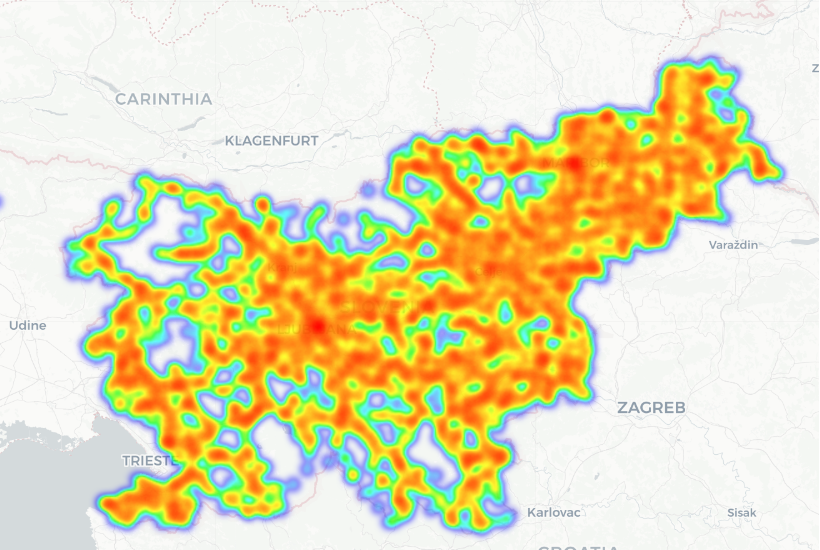

### 1. Opis problema

Cilj projektne naloge je analiziranje prometne varnosti na slovenskih cestah s pomočjo podatkov zadnjega desetletja (2014 - 2024). Z analizo raziskujemo pogoste vzroke za nastanek prometnih nesreč in možne korelacije, ki pripomorejo k verjetnosti za nastanek. Do sedaj smo raziskali časovne vplive, kot so dan v tednu, ura v dnevu, dan v letu, korelacije glede na vremenske okoliščine in trend vožnje pod vplivom alkohola.

### 2. Podatki in čiščenje

Podatke smo prenesli iz odprte baze evidenc, ki jih zbira policija na spletni strani ([policija.si](https://www.policija.si/o-slovenski-policiji/statistika/prometna-varnost)). Letna poročila so shranjena v posameznih .csv datotekah, ki jih je bilo pred analizo potrebno združiti v data frame, počistiti neveljavne vnose in premisliti o manjkajočih vrednostih.

Ključni koraki čiščenja podatkov:
1. **Združevanje:** Vsaka nesreča ima unikaten ID, ki se znotraj letnega poročila pojavi tolikokrat, kolikor je bilo udeležencev v tisti nesreči. Ker je ID nesreče samo inkrementalno število se lahko isti ID pojavi v vseh poročilih, zato smo vsaki nesreči dodelili unikaten ID v obliki **\<leto\>\_\<št\_nesreče\>**.

3. **Manjkajoče vrednost**: Vzrok manjkajočih vrednosti je bila pogosto napaka pri vnosu, ki se jo je dalo iz konteksta hitro ugotoviti.
    - Udeleženci s praznim atributom "UEStalnegaPrebivalisca" so bili večinoma državljani tujih držav, zato smo takim vnosom vnesli "TUJINA"
    - Pri manjkajočih vrednostih atributa "Starost" je bilo potrebno malo premisliti, saj bi imputacija lahko pomenila popačene podatke pri nadaljnjih analizah (npr. imputacija 0 bi pomenila, da so vsi taki udeleženci novorojenčki). Začasno smo te vrednosti pustili pri miru (možne rešitve bi bile naprimer imputacija mediane).

4. **Čiščenje podatkov:** Pri nekaterih atributih je bilo potrebno poenotiti zapise , saj so se za enako stanje pojavili različni zapisi. Navadno je bila razlika v velikih začetnicah ali obrnjenih besadah naprimer pri državi (Slovenija -> SLOVENIJA) ali pri stanju prometa (NORMALEN -> TEKOČ (NORMALEN))

5. **Normalizacija:** Nekateri vnosi so bili nesmiselni in jih je zato bilo potrebno omejiti. Primer takih vnosov so naprimer izredno visoki vozniški staži (nad 85 let), stopnja alkoholiziranosti nad 3 mg/l (kar se smatra kot smrtna doza) ... Take vnose smo smiselno omejili in višje vnose izbrisali.

Tukaj bi dodal še zanimiv izris, ki je nastal kot posledica testiranja podatkov o koordinatah nesreč. Pri testiranju atributov smo razmišljali, kako bi preverili resničnost podatkov o koordinatah nakar smo prišli do ideje uporabe scatter plot grafa v aplikaciji Orange. Dobljen graf jasno prikazuje obliko Slovenije.

Po korakih obdelave podatkov smo dobili povsem prečiščeno in enotno podatkovno zbirko, ki smo jo za potrebe nadaljne analize shranili v svojo .csv datoteko. 

### 3. Analiza
#### 3.1. Porazdelitev glede na dan v letu

Z analizo smo v naših podatkih želeli pokazati nekaj zanimivosti povezanih s časom, in sicer porazdelitev prometnih nesreč glede na dneve v letu, porazdelitev po dnevih v tednu in porazdelitev po urah.

Iz grafa lahko razberemo nekaj zanimivih datumov, kjer so nesreče manj verjetne. Večinoma se dnevi z manj nesrečami ujemajo z dela prostimi dnevi, kot so praznik dela, dan državnosti in božičem. Okoli božiča je še posebej izrazit "naval" pred praznikom in majhna verjetnost po prazniku, ki narašča vse do novega leta, kjer se ponovno zmanjša. Vidimo lahko tudi, da sta v povprečju najnevarnejši obdobji pred božičem in meseci v začetku poletja. Še ena posebnost, ki jo velja omeniti je 29. februar, ki se zaradi prestopnega leta v podatkih pojavi štirikrat manj kot ostali, vendar to še ne pomeni, da je ta dan bolj "varen".
Zanimivo je tudi dejstvo, da se kljub ogromni količine obiskovalcev v poletnih mesecih takrat ne zgodi več nesreč.

#### 3.2. Porazdelitev glede na dan v tednu in uro

Pogledali smo si tudi porazdelitev po dnevih v tednu in po urah, kjer smo prišli do večinoma pričakovanih rezultatov. Nekoliko presenetljivo je morda dejstvo, da je v jutranji konici relativno malo nesreč, čeprav je v jutranji špici načeloma podobno število ljudi kot v popoldanski.

#### 3.3. Verjetnost nastanka "večjih" nesreč glede na vreme

Pri tem primeru smo želeli pokazati korelacijo med večjimi nesrečami (nesreče z vsaj tremi udeleženci) in vremenskimi okoliščinami. Hitro smo ugotovili, da se večina nesreč zgodi pri jasnem vremenu, zato smo morali podatke najprej normalizirati tako, da smo verjetnost računali kot razmerje med št. velikih nesreč deljeno z vsemi nesrečami znotraj vremenske okoliščine.
Izkaže se, da je verjetnost večje nesreče najbolj verjetna kadar je megla, nekoliko presenetljivo pa je dejstvo, da je na drugem mestu oblačno vreme, namesto naprimer deževno ali sneg.
Glede na podatke lahko sklepamo, da so te nesreče večinoma naleti zaradi slabe vidljivosti.

#### 3.4. Trend vožnje pod vplivom alkohola pri mlajših voznikih (<30)

Tukaj lahko opazujemo trend vožnje pod vplivom alkohola pri mlajši populaciji. Če upoštevamo, da je bilo leto 2020 odstopajoče zaradi COVID-19, lahko rečemo, da med mladimi vozniki vožnja pod vplivom alkohola upada, pri čemer so prisotna le manjša odstopanja. 
Velja opomniti tudi, da tej podatki prikazujejo vse voznike, ki so na alkotestu pokazali vrednosti večje od nič in ne samo tiste, ki so prekoračili zakonsko določeno mejo.

#### 3.5. Prikaz nomogorama verjetnosti za nastanek hudih poškodb glede na atribute

Ideja nomograma je na interaktiven način pokazati kako se glede na izbrane atribute viša ali niža verjetnost za prometno nesrečo, kjer so udeleženci utrpeli hujše poškodbe. 
Iz nomograma lahko razberemo, da največ točk vrsta ceste, kjer so razlike med hitro in lokalno oz. turistično cesto ogromne. Prav tako se verjetnost drastično poviša pri udeleženicih, ki ne uporabljajo varnostnega pasu. 
Nekoliko presenetljivo je morda dejstvo, da je verjetnost glede na vremenske okoliščine najvišja pri vetrovnem vremenu.

#### 3.6. Razporeditev koordinat nesreč na zemljevidu

Za prikaz prostorske razporeditve prometnih nesreč smo uporabili geografske koordinate nesreč in jih prikazali na zemljevidu Slovenije. Ker se ista nesreča v podatkih lahko pojavi večkrat zaradi več udeležencev, smo za vizualizacijo upoštevali le en zapis za vsako nesrečo.

Koordinate smo pretvorili v zemljepisno širino in dolžino ter pripravili toplotni zemljevid (heatmap), ki omogoča bolj pregleden prikaz območij z večjo koncentracijo nesreč.

Toplotni zemljevid pokaže, da prometne nesreče niso enakomerno razporejene po prostoru. Večja koncentracija nesreč je opazna v okolici večjih mest in vzdolž pomembnejših prometnih povezav, kar je pričakovano zaradi večje gostote prometa in večje obremenjenosti cestne infrastrukture.